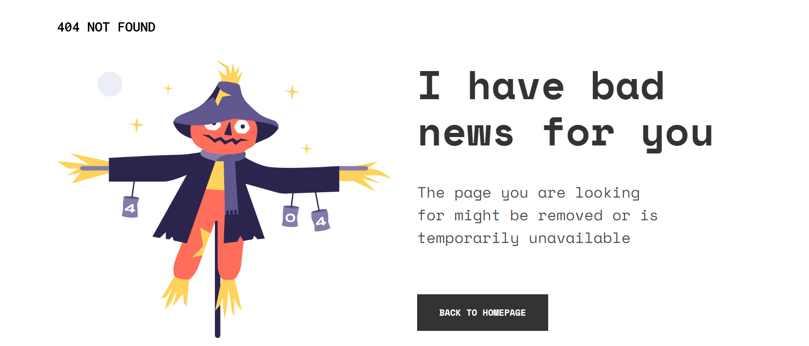

<!-- Please update value in the {}  -->

<h1 align="center">404 not found</h1>

   Solution for a challenge from  <a href="http://devchallenges.io" target="_blank">Devchallenges.io</a>.

  <h3>
    <a href="https://{your-demo-link.your-domain}">
      Demo
    </a>
     | 
    <a href="https://{your-url-to-the-solution}">
      Solution
    </a>
     | 
    <a href="https://legacy.devchallenges.io/challenges/wBunSb7FPrIepJZAg0sY">
      Challenge
    </a>
  </h3>

<!-- TABLE OF CONTENTS -->

## Table of Contents

- [Overview](#overview)
  - [Built With](#built-with)
- [Features](#features)
- [Contact](#contact)

<!-- OVERVIEW -->

## Overview

### Built With

<!-- This section should list any major frameworks that you built your project using. Here are a few examples.-->

- HTML
- CSS

## Features

<!-- List the features of your application or follow the template. Don't share the figma file here :) -->

This application/site was created as a submission to a [DevChallenges](https://legacy.devchallenges.io/) challenge. The [challenge](https://legacy.devchallenges.io/challenges/wBunSb7FPrIepJZAg0sY) was to build an application to complete the given user stories.

## Contact

- GitHub [@vc743](https://{github.com/vc743})
- Twitter [@vc_743](https://{twitter.com/vc_743})
